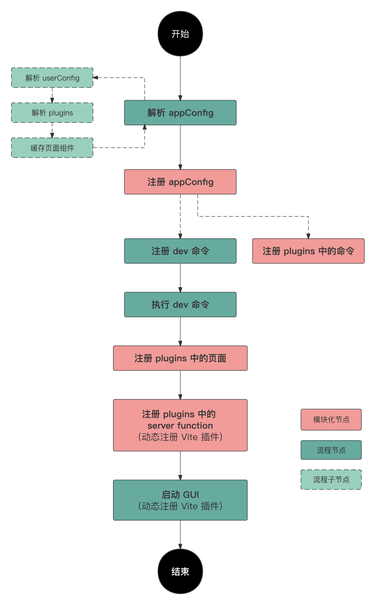

## 简介

一款基于 Vite、Vue3 的脚手架模块化解决方案，支持通过插件来扩展 UI、server function 和 command。

`Sili` 的初衷是方便 [Spider 开发框架](https://sky.sankuai.com/docs/nibfe/spider/) 扩展一些提效的相关能力，但是它的模块化能力使得它非常适合作为一个独立的解决方案，来为个人或团队快速组装自己的脚手架工具，整合自己的一些通用能力。

## 脚手架工作流程

