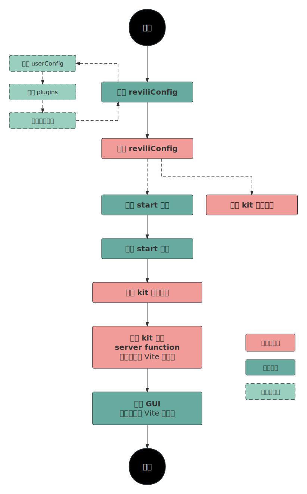

## 简介

Revili is a command and GUI integration tool based on vite.

Revili allows you to expand functionality through kit. Kit is a fully functional revili extension package, that includes commands, client and server of GUI. Kit are independent of each other.

## 脚手架工作流程

